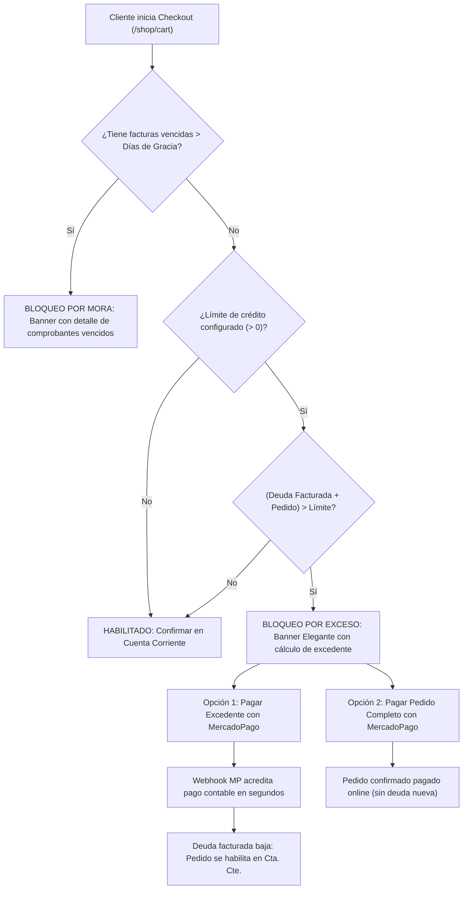

# Intranet B2B para Franquicias y Distribución — Base B2B con Bloqueo Financiero Inteligente

**Fecha:** 2026-09-08  
**Cliente:** EntreDos  
**Plataforma:** Odoo 19 Enterprise sobre Odoo.sh  
**Rama objetivo:** `19.0`  
**Estado:** Especificación de Diseño (Aprobada para planificación)

---

## 1. Contexto y Visión de Negocio

EntreDos opera actualmente una intranet propia donde sus clientes B2B (franquiciados y distribuidores mayoristas) cargan sus pedidos. Estos pedidos se extraen manualmente y se vuelven a cargar en Odoo para iniciar la producción y despacho.

El objetivo estratégico es **reemplazar completamente esa intranet por el e-commerce y portal nativos de Odoo 19**, naciendo los pedidos directamente como `sale.order` para eliminar la doble carga y los errores manuales.

Para que EntreDos pueda realizar el **reemplazo total (Go-Live)** y dar de baja su intranet previa, la **Base B2B** no puede limitarse a mostrar catálogos y precios: debe incluir desde el primer día el control y mitigación del riesgo crediticio:
1. Operar en **dos canales diferenciados**: Sitio Web de **Franquicias** y Sitio Web de **Distribución**.
2. **Bloqueo automático de compras** a clientes con deuda irregular (facturas vencidas fuera de período de gracia o exceso de límite de crédito).
3. **Mecánica elegante de cobranza proactiva**: no frustrar la compra informando límites internos, sino calcular el excedente adeudado y ofrecer el cobro inmediato mediante **MercadoPago** para liberar el pedido en cuenta corriente.

---

## 2. Decisiones de Arquitectura

| # | Decisión | Alternativa descartada | Justificación |
|---|---|---|---|
| **D1** | Construir sobre `website_sale` nativo + módulos específicos | Portales ad-hoc con controladores propios o mantener intranet externa vía API | Máxima mantenibilidad, compatibilidad con upgrades de Odoo SH y soporte nativo de pasarelas, promociones e inventario. |
| **D2** | Dos Sitios Web nativos (`website`) con dominios y listas de precios propios | Un único sitio con lógica condicional compleja en QWeb | Odoo multi-website aísla de forma nativa catálogos, carritos, sesiones de cookies, SEO y listas de precios base. |
| **D3** | Cliente dual = Partner comercial por CUIT + Contacto hijo por canal | Contacto único conmutando canales | Permite asignar listas de precios independientes, usuarios de portal con emails distintos y consolidar deuda contable en el padre (`commercial_partner_id`). |
| **D4** | Límite de crédito evaluado **exclusivamente sobre deuda facturada** | Límite nativo estándar (`partner_credit_warning`) que suma pedidos no facturados | La realidad de cuenta corriente de EntreDos exige controlar lo efectivamente emitido y facturado (`partner.credit`), simplificando el cálculo contable y evitando fricciones por pedidos pendientes de entrega. |
| **D5** | Días de gracia configurables **por Sitio Web** para facturas vencidas | Regla dura de 0 días o tolerancia global fija | Permite una política comercial más flexible con Franquicias (ej. 5 días de gracia) y más rigurosa con Distribución (ej. 0 o 2 días). |
| **D6** | Mensaje de checkout elegante enfocado en saldo adeudado y regularización | Bloqueo seco informando el límite de crédito interno | No ventila límites de crédito confidenciales y le indica al cliente con precisión su saldo adeudado y el excedente que debe regularizar en su cuenta corriente para poder confirmar. |
| **D7** | Publicación estándar mediante `website_id` nativo y bultos por `uom_ids` | Módulos complejos de packaging o catálogo por grupos | Odoo 19 soporta multi-UoM nativo en checkout (`uom_ids`) y aislamiento de productos por website. |

**Regla Transversal de Dominio:** El canal pertenece al pedido (`sale.order.website_id`), no al partner. La deuda y el crédito se consolidan en el CUIT padre (`commercial_partner_id`), permitiendo que el cliente dual opere con consistencia financiera en ambos canales.

---

## 3. Alcance

### 3.1 Incluido en la Base B2B
- Configuración de dos sitios web independientes: **Franquicias** y **Distribución**.
- Reglas de catálogo: productos exclusivos por canal (`website_id`) o compartidos (vacío).
- Soporte de bultos y unidades en el carrito mediante unidades de medida secundarias (`uom_ids`).
- Precios de lista base por canal y tarifas personalizadas por cliente (`property_product_pricelist`).
- Restricción de acceso a tiendas para que cada cliente opere en el canal autorizado, neutralizando bucles de redirección de Odoo 19.
- Bloqueo financiero automático en el checkout web por:
  - Facturas vencidas impagas (considerando días de gracia del sitio web).
  - Límite de crédito superado evaluando: $\text{Deuda Facturada} + \text{Pedido Actual} > \text{Límite de Crédito}$.
- Banner elegante en el checkout que informa el saldo en cuenta corriente y el excedente a regularizar, inhabilitando la confirmación del pedido a Cuenta Corriente mientras persista el bloqueo.
- Integración transparente con el módulo existente `partner_channel` para propagar el canal comercial a `sale.order`.
- Bloqueo complementario en backend (`sale.order.action_confirm`) enlazado al flujo de `waiting_approval` (Supervisor).

### 3.2 Postergado para fases posteriores
- Pasarela online de cobro directo de excedente (MercadoPago u otros proveedores): se deja para una fase posterior. Se valida la viabilidad nativa de pagos a cuenta sin venta asociada mediante la ruta `/payment/pay`.
- Límites máximos de compra por producto y por bulto según tipo de tienda (A/B/C).
- Echeq como medio de pago con validación diferida.
- Scoring integral de franquiciados (mistery shopper, comercial, auditoría).
- Portal de novedades y comunicados institucionales.

---

## 4. Diseño Funcional y Flujos de Usuario

### 4.1 Experiencia del Cliente en el Carrito y Checkout



#### Caso 1: Cliente sin deuda o dentro del límite
* El checkout muestra las opciones de pago habituales, destacando **"Cuenta Corriente"**.
* El cliente confirma el pedido, el cual nace directamente como `sale.order` con su `website_id` asignado.

#### Caso 2: Cliente con facturas vencidas (fuera de días de gracia)
* El método "Cuenta Corriente" queda bloqueado/deshabilitado.
* Se presenta un banner destacado:
  > *"Tu cuenta presenta comprobantes vencidos pendientes de regularización por un total de **\$XX.XXX**. Para habilitar compras en cuenta corriente, por favor aboná tu saldo adeudado o contactate con Administración."*
* Botón directo de acción: **`[ Ver comprobantes y pagar con MercadoPago ]`**.

#### Caso 3: Cliente que excede el límite con la nueva compra
* Supongamos:
  * Límite de crédito (interno): \$1.000.000
  * Deuda facturada actual (`partner.credit`): \$800.000
  * Pedido actual en carrito: \$300.000
  * Exposición total: \$1.100.000 $\rightarrow$ Excedente: **\$100.000**.
* El sistema **no** muestra el límite interno de \$1M.
* El banner expone con claridad comercial:
  > *"Tenés un saldo en cuenta corriente de **\$800.000**. Para confirmar este pedido de **\$300.000** en cuenta corriente, aboná **\$100.000** con MercadoPago y liberá tu compra al instante."*
* Dos salidas inmediatas:
  1. **`[ Pagar $100.000 con MercadoPago ]`**: Genera el cobro por el excedente. Una vez acreditado por webhook, imputa un pago contable a la cuenta corriente, el saldo baja a \$700.000 y el botón "Confirmar en Cuenta Corriente" se activa solo.
  2. **`[ Pagar este pedido completo ($300.000) con MercadoPago ]`**: El pedido se cancela contra la pasarela online y no genera deuda en cuenta corriente.

---

## 5. Diseño Técnico y Estructura de Módulos

El desarrollo se compone de **dos módulos limpios y desacoplados**:

### Módulo 1: `website_sale_b2b_credit_block` (19.0.1.0.0)

Responsable del control de crédito, días de gracia, prevención de bucles y flujo de cobranza en el e-commerce.

#### Modelos y Extensiones

1. **`website` (`models/website.py`)**:
   ```python
   b2b_credit_block_active = fields.Boolean(
       string="Activar bloqueo financiero B2B",
       default=True,
       help="Habilita el control de facturas vencidas y límite de crédito en el checkout."
   )
   b2b_grace_period_days = fields.Integer(
       string="Días de gracia para facturas vencidas",
       default=0,
       help="Días de tolerancia tras el vencimiento de una factura antes de bloquear compras."
   )
   ```

2. **`res.partner` (`models/res_partner.py`)**:
   ```python
   b2b_website_ids = fields.Many2many(
       comodel_name="website",
       relation="res_partner_website_rel",
       column1="partner_id",
       column2="website_id",
       string="Canales autorizados (Websites)",
       help="Sitios web en los que este contacto tiene autorización para operar."
   )
   b2b_grace_period_override = fields.Integer(
       string="Días de gracia personalizados",
       default=-1,
       help="Si es >= 0, anula los días de gracia predeterminados del sitio web."
   )
   ```

3. **Lógica de evaluación financiera (`sale.order` o `res.partner`)**:
   ```python
   def _get_b2b_financial_status(self, website):
       """
       Evalúa la situación financiera del commercial_partner_id para un website dado.
       Retorna un diccionario con estado de bloqueo, causas y montos.
       """
       self.ensure_one()
       partner = self.partner_id.commercial_partner_id
       today = fields.Date.context_today(self)
       
       # Días de gracia aplicables
       grace_days = partner.b2b_grace_period_override if partner.b2b_grace_period_override >= 0 else website.b2b_grace_period_days
       cutoff_date = today - timedelta(days=grace_days)
       
       # 1. Facturas vencidas impagas
       overdue_moves = self.env['account.move'].search([
           ('partner_id', 'child_of', partner.id),
           ('move_type', 'in', ('out_invoice', 'out_receipt')),
           ('state', '=', 'posted'),
           ('payment_state', 'not in', ('in_payment', 'paid', 'reversed')),
           ('invoice_date_due', '<', cutoff_date),
       ])
       has_overdue = bool(overdue_moves)
       overdue_amount = sum(overdue_moves.mapped('amount_residual'))
       
       # 2. Límite de crédito (solo deuda facturada)
       invoiced_debt = partner.credit  # Saldo contable en cuentas a cobrar
       credit_limit = partner.credit_limit
       order_amount = self.amount_total
       
       exceeds_limit = False
       excess_amount = 0.0
       if credit_limit > 0:
           total_exposure = invoiced_debt + order_amount
           if total_exposure > credit_limit:
               exceeds_limit = True
               excess_amount = total_exposure - credit_limit
               
       return {
           'is_blocked': has_overdue or exceeds_limit,
           'has_overdue': has_overdue,
           'overdue_amount': overdue_amount,
           'invoiced_debt': invoiced_debt,
           'credit_limit': credit_limit,
           'order_amount': order_amount,
           'exceeds_limit': exceeds_limit,
           'excess_amount': excess_amount,
       }
   ```

4. **Corrección del Bucle Infinito en `has_ecommerce_access` y Controllers**:
   * En `website.has_ecommerce_access()`:
     ```python
     def has_ecommerce_access(self):
         # Usuarios internos siempre tienen acceso a previsualizar la tienda
         if self.env.user._is_internal():
             return True
         # Comportamiento estándar para usuarios públicos
         if self.env.user._is_public():
             return super().has_ecommerce_access()
         # Verificación por canal para usuarios portal
         partner = self.env.user.partner_id
         if partner.b2b_website_ids and self not in partner.b2b_website_ids:
             return False
         return super().has_ecommerce_access()
     ```
   * **Controller Override (`website_sale/controllers/main.py` & `cart.py`)**:
     Si `has_ecommerce_access()` es `False` pero el usuario **no es público**, redirigir a `/my` con mensaje explicativo en sesión (*"Tu usuario no tiene habilitado el acceso al canal de Distribución"*), **evitando redirigir a `/web/login`** que causa el bucle infinito de Odoo.

5. **Resolución de URL de Invitación (`portal.wizard`)**:
   * Sobreescritura de `res.partner.get_base_url()`: si el contacto posee canales en `b2b_website_ids`, devolver el dominio público de dicho website en lugar del genérico `web.base.url`.

---

### Módulo 2: `website_sale_product_channel_ux` (19.0.1.0.0)

Responsable de la usabilidad y gobierno del catálogo multicanal en el backoffice.

1. **Ficha de Producto (`product.template`)**:
   * Campo `website_id` visible en posición destacada con placeholder explícito: *"Todos los canales (Franquicias y Distribución)"*.
2. **Vista Lista de Productos**:
   * Columna "Canal Web" (`website_id`) visible por defecto (`optional="show"`).
   * Filtros de búsqueda rápidos: *"Exclusivo Franquicias"*, *"Exclusivo Distribución"*, *"Visible en Ambos"*.
   * Agrupador por canal en la vista de búsqueda.
3. **Acción de Servidor Masiva**:
   * Asistente / acción en el menú contextual de la lista para seleccionar $N$ productos y asignarles masivamente: `Franquicias`, `Distribución` o `Todos los canales` (`website_id = False`).

---

## 6. Puntos de Extensión Verificados en Odoo 19

| Componente | Archivo en Odoo 19 | Uso y Validación |
|---|---|---|
| `website.has_ecommerce_access()` | `addons/website_sale/models/website.py:1014` | Punto de validación de visibilidad de tienda. Corregido para bypass de usuarios internos y control de canal. |
| `website.controllers.main:shop` | `addons/website_sale/controllers/main.py:291` | Interceptación de redirección errónea a `/web/login` para usuarios autenticados sin permiso de canal. |
| `sale.order._cart_add()` | `addons/website_sale/models/sale_order.py:347` | Soporte nativo de `uom_id` para agregado de bultos o unidades. |
| `product.template.uom_ids` | `addons/product/models/product_template.py:122` | M2M nativo con `uom.uom` para configurar bultos de venta. |
| `product.pricelist._is_available_on_website()` | `addons/website_sale/models/product_pricelist.py:98` | Resolución de tarifas de cliente respetando el `website_id` del canal. |
| `res.partner.credit` | `addons/account/models/partner.py:372` | Campo contable optimizado en SQL que refleja exactamente la deuda facturada (`asset_receivable`). |
| `payment_mercado_pago` | `addons/payment_mercado_pago` | Pasarela nativa en Odoo 19 para cobrar el excedente o pedido completo con acreditación instantánea. |
| `portal.wizard` | `addons/portal/wizard/portal_wizard.py:220` | Invitación masiva de contactos respetando la URL base del canal correspondiente. |

---

## 7. Criterios de Aceptación

1. **Aislamiento de Canales:**
   * Un usuario de Franquicia logueado entra a su sitio web y ve catálogo y precios de su canal. Si navega al sitio de Distribución, se le redirige prolijamente a `/my` con un mensaje claro, sin provocar bucle de redirección (`ERR_TOO_MANY_REDIRECTS`).
2. **Listas de Precios Preferenciales:**
   * El cliente sin login ve la lista base del sitio (la más cara).
   * Al loguearse, el catálogo y carrito reflejan automáticamente su lista negociada configurada en el contacto (`property_product_pricelist`).
3. **Bloqueo por Facturas Vencidas:**
   * Si el cliente tiene facturas vencidas con más días de mora que los días de gracia del website, la opción de Cuenta Corriente queda inhabilitada y ve el detalle de su mora.
   * Si la mora está dentro de los días de gracia configurados, puede confirmar su pedido normalmente.
4. **Bloqueo Inteligente y Cobro con MercadoPago:**
   * Si $(\text{Deuda Facturada} + \text{Pedido Actual}) > \text{Límite de Crédito}$, el banner calcula exactamente el excedente a abonar.
   * El cliente no ve su límite interno (\$1M), solo ve su saldo adeudado y el monto a pagar.
   * Al pagar el excedente con MercadoPago, el webhook impacta el pago en Odoo, la deuda contable disminuye y el pedido se desbloquea de inmediato en Cuenta Corriente.
5. **Cliente Dual:**
   * Posee un contacto por canal, cada uno con su email y lista de precios. La deuda contable de ambos canales se acumula bajo el mismo CUIT padre.
6. **Gestión de Catálogo:**
   * Desde la lista de productos del backoffice se puede filtrar y asignar en lote el canal de publicación a $N$ artículos en un solo paso.

---

## 8. Estrategia de Pruebas

- **Pruebas Unitarias (`TransactionCase`):**
  - Cálculo de días de gracia con fechas límite móviles.
  - Cálculo de exposición financiera: deuda facturada + pedido vs límite.
  - Validación de que órdenes no facturadas (`credit_to_invoice`) **no** impactan en el cálculo de bloqueo.
- **Pruebas de Integración Web (`HttpCase`):**
  - Verificación de no-redirección infinita de usuario Franquicia entrando a Distribución.
  - Renderizado dinámico del banner de MercadoPago en el checkout cuando se supera el límite.
  - Desbloqueo reactivo del carrito tras registrar un pago contable.
- **Prueba End-to-End en Staging (Odoo.sh):**
  - Simulación completa de cliente real con catálogo importado, facturas simuladas vencidas y prueba de checkout en ambos websites.
